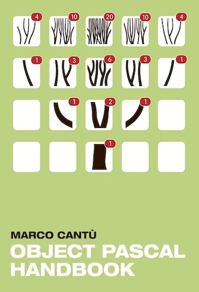
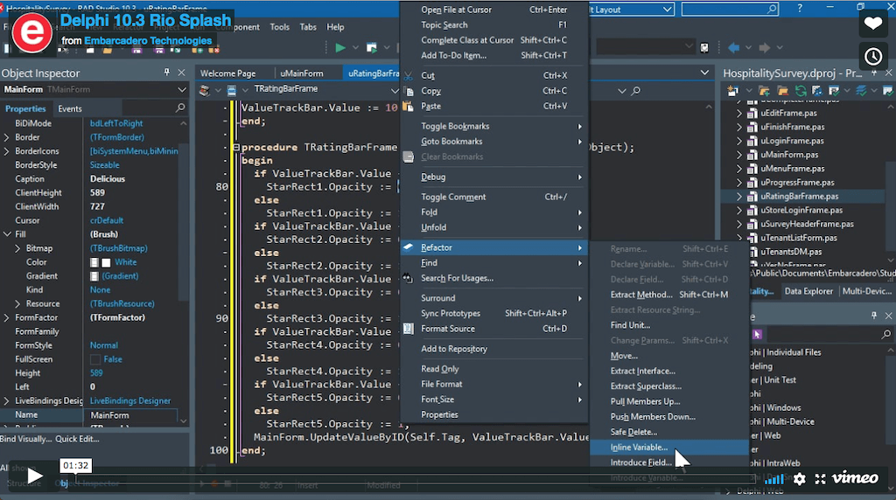

# Cara Belajar Pemrograman

> **A Word of Advice**
>
> Every programming book is designed to make programming approachable. Every software development course is designed to make software development approachable. But you will get stuck. All programmers get stuck.
>
> Learning to program is hard. And building applications is harder. You'll feel discouraged when you can't get something to work just right. You'll frustrated when you've been stuck for hours on the same problem. And you may want to quit when you don't understand something.
>
> But it gets easier. It turns into a puzzle. You'll experience a rush of adrenaline when you hit the `RUN` button and your program works, especially after you've spent hours or even days trying to get one little thing to work just right. You'll smile when you write code that runs perfectly on the first try. And you'll celebrate when your first application goes live and being used by a real user.
>
> You're excited to see what you will come up with later.
>
> —————    
> *Inspired by "[**Everyone Can Code**][1]" book from Apple.*

Belajar pemrograman itu memang sulit, tapi semua orang bisa melakukannya. Pemrograman adalah ilmu berpikir. Dan ilmu berpikir adalah salah satu kemampuan dasar manusia, sama seperti membaca, menulis, dan berhitung. Semua orang pasti bisa memahaminya jika mau belajar dengan baik dan tekun. Sama seperti belajar sepeda itu sulit, bahkan seringkali sampai jatuh dan terluka, tapi toh semua orang bisa melakukannya.

Kendala kebanyakan pembelajar pemrograman bukanlah kurangnya kemampuan, melainkan lebih karena cara belajar yg kurang tepat. Sama seperti belajar hal apa pun, ada cara-cara tertentu yg khusus untuk belajar pemrograman. Belajar pemrograman tidak sama caranya dengan belajar ilmu sejarah, atau ilmu ekonomi, atau ilmu biologi, dan lain-lain. Pembelajar pemrograman harus paham bagaimana cara belajar pemrograman yg tepat agar mencapai pemahaman dan kemampuan yg optimal. Bagaimana caranya?

## 1. Pilih Bahasa yg Cocok Untuk Pemula

Ini sudah saya jelaskan di artikel sebelumnya, [Bahasa Pemrograman Untuk Pemula][2]. Bahasa pemrograman yg saya sarankan bagi pemula adalah bahasa Pascal. Tentu bahasa Pascal yg modern, bukan yg kuno.

## 2. Pahami Konsep dan Prinsip Dasar Pemrograman

Ini sudah saya jelaskan panjang lebar di buku kecil saya, [Bekal Belajar Pemrograman][3]. Di buku tersebut saya membahas tentang konsep dan prinsip dasar dalam pemrograman, termasuk pola pikir pemrogram itu sendiri.

## 3. Pelajari Panduan Bahasa Pemrograman

Di grup pemrograman [Pascal Indonesia][4], saya pernah sampaikan, *"Jangan sekali-kali menulis sebaris pun kode program jika belum paham tata cara penulisan bahasa pemrograman (syntax) yg digunakan."* Logikanya, bagaimana mungkin seseorang bisa menulis kode program dengan benar jika cara menulisnya saja belum tahu? Mustahil. Ibaratnya, kita ingin bicara dalam bahasa Inggris tapi kita tidak tahu sedikit pun kosakata dan tata bahasa Inggris. Apa mungkin bisa?

Panduan bahasa pemrograman umumnya berupa buku (cetak). Sebelum mulai menulis program, bacalah terlebih dahulu buku panduan bahasa pemrograman yg digunakan. Tentu bacalah buku yg membahas versi bahasa yg terbaru dan masih digunakan saat ini, jangan versi *jadul* yg sudah tidak dipakai lagi. Misalnya belajar bahasa Pascal, bacalah buku yg membahas [bahasa Pascal modern][5], jangan buku yg membahas bahasa Pascal *jadul* seperti [Turbo Pascal][6].

Namun jaman sekarang, buku panduan tidak harus dalam bentuk buku cetak. Panduan dalam bentuk buku digital (*ebook*) yg tersedia daring justru lebih mudah didapatkan. Bisa juga tersedia dalam bentuk wiki yg dilengkapi dengan fitur pencarian. Berikut beberapa panduan bahasa Pascal yg bisa dipelajari:

* Buku [*Essential Pascal*][7] oleh Marco Cantù.
* Buku [*Object Pascal Handbook*][8] oleh Marco Cantù.
* Panduan bahasa Pascal dari [pp4s.co.uk][9].
* Panduan bahasa Pascal dari [tutorialspoint.com][10].
* Panduan bahasa Pascal dari [pascal-programming.info][11].

Berikut adalah daftar referensi (acuan) bahasa Pascal:
* Dokumen bahasa [Free Pascal][12].
* Dokumen wiki [Free Pascal dan Lazarus IDE][13].
* Dokumen wiki [Delphi][14] dari Embarcadero.

> **Catatan**: Free Pascal dan Delphi adalah sama-sama dialek bahasa (*Object*) Pascal modern dengan tingkat kompatibilitas yg tinggi (lebih dari 90%). Bagi pemula keduanya bisa dibilang sama saja. Buku panduan Delphi bisa digunakan di Free Pascal, dan sebaliknya. Perbedaan keduanya baru muncul pada kemampuan bahasa Pascal tingkat menengah ke atas.

Semua dokumen di atas ditulis dalam bahasa Inggris. Jika bahasa Inggris masih menjadi kendala, silakan belajar bahasa Inggris terlebih dahulu. Pemrograman adalah ilmu yg berasal dari negeri yg berbahasa Inggris, jika ingin paham ilmunya maka harus paham bahasanya. Sementara kemampuan bahasa Inggris masih kurang, silakan beli buku cetak bahasa Pascal yg berbahasa Indonesia. Atau bisa juga dimulai dari buku kecil [ini][15].

## 4. Pasang Aplikasi Penyunting atau IDE

Menulis kode program tentu butuh aplikasi penyunting (*editor*), tapi bukan penyunting biasa seperti aplikasi Notepad. Gunakanlah aplikasi penyunting khusus pemrograman yg menyediakan fitur-fitur yg membantu dan memudahkan dalam menulis kode program, atau biasa disebut IDE (*integrated development environment* atau lingkungan pengembangan terpadu). Dan yg terpenting adalah harus menyediakan fitur dan alat bantu untuk [awakutu][16]. Fitur awakutu **sangat penting** bagi pemula. Pemula harus menghindari penyunting yg tidak menyediakan alat awakutu.

> *"Seseorang tidak layak disebut pemrogram jika belum menguasai teknik awakutu (debugging)."*    
> *~Pak Lebah*

Untuk pengguna Free Pascal, hindari penyunting teks (*console*) bawaan Free Pascal. Sekarang sudah abad 21, gunakanlah penyunting grafis (GUI atau *graphical user interface*). Penyunting teks bawaan Free Pascal lebih ditujukan untuk pemrogram yg sudah pintar di lingkungan teks (CLI atau *command line interface*) dan fitur yg disediakan sangat terbatas sehingga sangat tidak cocok bagi pemula. Saya sarankan gunakan [Lazarus IDE][17] (untuk Free Pascal) atau [Delphi][18] yg memiliki banyak fitur canggih. Atau minimal, gunakanlah [Free Pascal dengan Visual Studio Code][19].

## 5. Mulai Belajar Membuat Program

Pemrograman selain merupakan ilmu, juga menerupakan keahlian (*skill*). Yg namanya keahlian harus dipraktekkan secara terus-menerus untuk menjaga, mengasah, dan meningkatkan kemampuan yg dimiliki. Membaca buku saja –sebanyak apa pun buku yg dibaca– namun tanpa praktek sama sekali, tidak akan membuat pemula menjadi pemrogram yg ahli. Sama seperti belajar berenang, membaca selemari buku teknik berenang namun tidak pernah masuk ke kolam renang, tidak akan membuat pembacanya mendadak jadi perenang yg andal. Demikian pula pemrograman.

Setelah buku dibaca dan penyunting terpasang, selanjutnya adalah mulai membuat program. Paling mudah adalah mengikuti panduan dari buku yg dipelajari. Salah satu kiat sederhana agar lebih cepat memahami bahasa pemrograman adalah tidak melakukan salin-tempel (*copy-paste*) kode program dari internet atau buku (jika disertakan berkas kode programnya). Sebaiknya ketik ulang saja setiap program yg ingin dicoba. Selain membuat lebih paham bahasanya, ketik ulang juga akan membuat pemula jadi terbiasa dengan penyunting yg digunakan dengan mencoba berbagai fitur-fiturnya.

Mempelajari program tidak cukup hanya dengan menulis program, menjalankannya, sukses, lalu selesai. Pemula harus betul-betul memahami setiap topik yg sedang dipelajarinya. Setiap huruf, angka, dan tanda baca dalam kode program itu ada maknanya. Pahami betul makna setiap aturan penulisan program (sintaks). Pahami cara kerja program dengan menjalankan kode program baris per baris dan ikuti alurnya. Di sinilah pentingnya pemahaman pada [awakutu][16]. Cobalah bereksperimen dengan mengubah contoh kode program yg diberikan. Jangan takut salah, justru dari kesalahanlah pemula bisa belajar menjadi lebih baik.

Satu hal yg penting diingat adalah belajarlah hingga tuntas, berdasarkan buku panduan yg digunakan. Ikuti dan pahami contoh program yg diberikan sejak yg paling awal hingga yg paling akhir. Jangan belajar bahasa pemrograman setengah-setengah lalu beralih ke bahasa pemrograman yg lain karena bisa jadi akan membingungkan dan justru makin menyulitkan pemahaman, atau lebih buruk lagi yaitu menimbulkan salah paham.

## 6. Luangkan Waktu Untuk Berlatih Secara Rutin

Kembali ke analogi berenang, apakah dengan berlatih renang hanya 1-2 kali akan membuat jadi perenang andal? Tentu tidak. Pemrogram yg sudah jago pun akan menurun keahliannya jika lama tidak membuat program. Apalagi pemula, harus selalu luangkan waktu secara rutin untuk membangun kemampuannya. Saran saya minimal berlatih seminggu sekali, misalnya sehari di akhir pekan digunakan khusus untuk berlatih pemrograman. Jika seorang pemula betul-betul ingin menjadi pemrogram yg andal, maka jadwalkan latihan rutin dan berlatihlah secara disiplin.

Berlatih membuat program apa? Apa saja. Pokoknya buatlah program dengan bahasa yg sedang dipelajari. Namun yg namanya pemula tentu tidak harus bikin program yg muluk-muluk dan rumit. Mulai dari yg sederhana saja dulu, lalu secara bertahap beranjak ke yg lebih sulit, disesuaikan dengan tingkat kemampuan yg sudah dipelajari. Supaya berlatihnya tidak membosankan, ada beberapa materi yg cocok sebagai latihan pemula, antara lain:

* **Olah matematika.** Berlatih matematika penting untuk mengasah kemampuan logika numerik pemrogram. Bisa dimulai dengan menyelesaikan soal-soal di situs [Project Euler][20], mulailah dari soal-soal yg mudah.

* **Olah grafis sederhana.** Berlatih grafis penting untuk mengasah kemampuan logika visual pemrogram. Bisa dimulai dengan membuat fraktal, penampil persamaan matematika, animasi partikel (seperti video di atas), menggambar dengan program, dsb. Bisa juga dilengkapi dengan interaksi dengan pengguna, baik melalui papan ketik atau tetikus. Kreatiflah.

* **Membuat *game* sederhana.** Berlatih membuat *game* penting untuk mengasah kemampuan membangun aplikasi yg terpadu sebab *game* melibatkan hampir seluruh kemampuan pemrograman, mulai dari matematika, visual, interaksi, antarmuka, olah data, dan memadukan semuanya menjadi sebuah permainan yg menarik. Mulailah dari *game* yg sederhana, misalnya Tic Tac Toe, atau Dakon, atau Silang Pentol, atau [Gaple][21], dan sebagainya.

* **Bermain *game* dengan program.** Siapa bilang belajar pemrograman tidak bisa dengan sambil bermain *game*? Bayangkan anda bermain perang-perangan di luar angkasa dengan pesawat luar angkasa, tapi... pesawatnya tidak dikendalikan dengan tombol atau tetikus, melainkan dengan kode program. Menarik bukan? Silakan mencobanya di [CodinGame][22].

## 7. Bergabung dengan Komunitas Pemrograman

Nah, apakah anda juga seorang pemula atau berniat belajar pemrograman? Anda boleh ikuti saran-saran saya di atas. Dan saya tunggu karya anda di grup [Pascal Indonesia][4]. Selamat belajar!

———  
💬 I welcome your comment [here](https://github.com/pakLebah/paklebah.github.io/issues/8).  
Thank you. 😊

---
← [Home](index.md) [Top](#top) ↑

[1]: https://www.apple.com/id/everyone-can-code/
[2]: https://paklebah.github.io/bahasa-pemrograman-pemula.html
[3]: https://pak.lebah.web.id/ebook/pascal.id_kulgram1.pdf
[4]: https://www.facebook.com/groups/pascal.id/
[5]: https://pak.lebah.web.id/pascal5.html
[6]: https://pak.lebah.web.id/saynototp.html
[7]: http://www.marcocantu.com/epascal/
[8]: http://forms.embarcadero.com/sDownloadMarcoseBook
[9]: http://pp4s.co.uk/main/tutorials.html
[10]: https://www.tutorialspoint.com/pascal/
[11]: http://www.pascal-programming.info
[12]: http://freepascal.org/docs.html
[13]: http://wiki.freepascal.org
[14]: http://docwiki.embarcadero.com/RADStudio/Rio/en/Main_Page
[15]: https://pak.lebah.web.id/ebook/bahasa-pascal.pdf
[16]: https://paklebah.github.io/mengenal-awakutu.html
[17]: https://www.lazarus-ide.org/
[18]: https://www.embarcadero.com/products/delphi
[19]: https://paklebah.github.io/fpc-dan-vscode.html
[20]: https://projecteuler.net/archives
[21]: https://github.com/git-bee/gaple
[22]: https://www.codingame.com/
