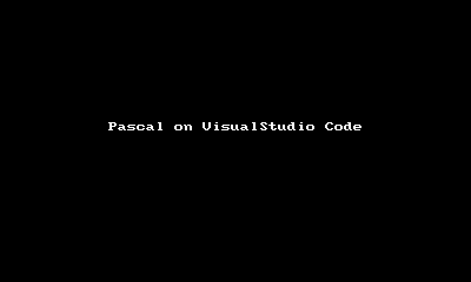
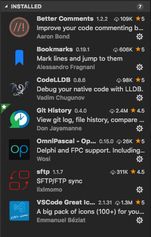
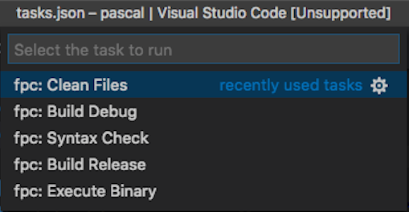

# Free Pascal dan VS Code

Beberapa waktu yg lalu, di grup [Pascal Indonesia][1] saya menyampaikan bahwa pemrogram [Pascal][2] tidak harus terikat dengan *IDE* seperti [Delphi][3] dan [Lazarus][4] saja. Apalagi jika kita tidak sedang membuat program *GUI* sehingga tidak perlu fitur perancangan form, misalnya membuat program *web* atau *console*. Lalu saya tunjukkan bahwa saya biasa menggunakan aplikasi penyunting [Visual Studio Code][5] dari [Microsoft][6] di komputer [Macbook Pro][7] saya. Ini yg saya tunjukkan:



Kemudian saya bagikan berkas-berkas pengaturan VS Code yg saya gunakan sehingga bisa seperti yg ditunjukkan dalam video di atas. Berkas-berkas pengaturan tersebut saya taruh di *gist* [Github][8] di sini meliputi: [`launch.json`][9], [`tasks.json`][10], and [`settings.json`][11]. Lalu saya tunjukkan juga *extension* yg saya gunakan, seperti pada gambar berikut.



Namun rupanya semua itu belum cukup jelas. Masih ada beberapa anggota grup Pascal.ID yg bertanya tentang bagaimana cara menulis program Pascal di VS Code. Karena itu, saya kemudian menulis artikel ini.

Baiklah… pertama, saya anggap anda sekalian sudah memasang (*install*) aplikas VS Code, ya. Jika belum terpasang, silakan unduh VS Code di [sini][12], lalu ikuti panduan cara memasangnya di [sini][13]. Silakan.

## Pemasangan Free Pascal

Kedua, saya anggap anda sekalian juga sudah memasang Free Pascal versi terbaru. Jika belum terpasang, silakan unduh Free Pascal di [sini][14], pilih sesuai sistem operasi yg anda gunakan. Untuk pengguna Windows 64 bit, berkasnya ada di dalam *folder* [Win32][15] (yg akhir nama berkasnya ada `win64`). Kemudian, silakan jalankan aplikasi pemasang dan ikuti panduan yg muncul.

Ketiga… ini penting, jangan lupa untuk mengunduh berkas kode Free Pascal. Kode sumber Free Pascal tersedia di [sini][16] (masih di [sourceforge.net][17] juga sih), pilih yg berakhiran `.zip` supaya lebih mudah membongkarnya. Setelah berkas selesai diunduh, bongkar (*extract*) berkas `.zip` tersebut ke sebuah *folder* (bisa mana saja asal bisa diakses oleh VS Code). Jika sourceforge.net dirasa kurang memuaskan, lambat misalnya, anda juga bisa mengunduh berkas-berkas tersebut melalui laman unduhan resmi Free Pascal di [sini][18].

## Pemasangan *Extension*

Keempat, setelah VS Code dan Free Pascal terpasang dengan baik dan benar, selanjutnya adalah memasang *extension* VS Code yg dibutuhkan. Memasang *extension* di VS Code sangat mudah. Cara pertama adalah melalui panel **Extension** (atau dari menu **View** → **Extensions**) di sisi kiri jendela VS Code, lalu cari nama *extension* yg ingin dipasang, kemudian klik tombol **Install** pada *extension* yg dimaksud. Cara kedua adalah melalui laman VS Code [Extension Marketplace][19], lalu cari nama *extension* yg ingin dipasang, kemudian klik tombol **Install** pada laman *extension* yg dimaksud.

Beberapa *extension* yg sifatnya **wajib** dipasang adalah:

1. [OmniPascal][20]  
Ini adalah *extension* bahasa Pascal dengan fitur terlengkap yg tersedia untuk VS Code. Omni Pascal hanya mendukung sintaks Free Pascal dan Delphi saja karena dua dialek Pascal itu yg paling terkenal dan banyak digunakan. Situs web resminya ada di [sini][21] dan jika anda ingin menyampaikan saran, kritik, permintaan, atau laporan kesalahan, bisa melalui laman di [sini][22].

2. [Native Debug][23]  
Bukan pemrograman namanya jika tidak bisa melakukan awakutu (*debugging*). Ini adalah *extension* untuk awakutu program Pascal kita nanti. Saya pribadi sebenarnya menggunakan [CodeLLDB][24] karena di Mac hanya tersedia LLDB, bukan GDB. Namun untuk selain pengguna Mac, saya sarankan gunakan NativeDebug saja, karena mendukung baik LLDB maupun GDB. Atau menggunakan *extension* awakutu lainnya pun tentu boleh-boleh saja, yg penting bisa melakukan awakutu.

3. [VSCode Great Icons][25]  
Walaupun tampak sepele, tapi *extension* ini cukup penting untuk membedakan berkas program Pascal dari berkas lainnya, yaitu berupa ikon khusus dalam panel berkas VS Code. Tanpa penanda yg jelas, kita akan lebih sulit memilih berkas dalam panel berkas. Sependek yg saya tahu, hanya *extension* ini yg mendukung ikon untuk berkas program Pascal, meliputi berkas `.pas`, `.lpr`, dan `.dpr`. Itu pun karena saya yg mengajukan permintaan ke pembuatnya dan membantu menyediakan ikon untuk Pascal.

Beberapa *extension* lain yg **disarankan** untuk dipasang juga antara lain:

1. [Git History][26]  
Ini adalah *extension* untuk menampilkan sejarah perubahan berkas kode program. VS Code secara bawaan sudah mendukung Git sebagai alat perekam perubahan berkas atau lazim disebut CSV (*code versioning system*) atau SCM (*source code management*). Namun fitur visual bawaan yg disediakan VS Code cukup terbatas, *extension* ini memberikan fitur yg lebih lengkap.

2. [Better Comments][27]  
Ini adalah *extension* untuk pengayaan warna pada baris komentar kode program. Dengan *extension* ini kita bisa memasang komentar bermakna khusus yg berbeda warna dengan komentar biasa. Misalnya, komentar yg menunjukkan kesalahan menggunakan warna merah, komentar yg perlu perhatian menggunakan warna kuning, komentar catatan menggunakan warna biru, dan sebagainya.

3. [Bookmarks][28]  
Ini adalah *extension* untuk menambahkan penanda pada baris program. Dengan *extension* ini kita bisa menandai baris-baris program yg penting dan perlu perhatian khusus. Misalnya, kita bisa dengan mudah kembali ke baris yg kita tandai setelah kita meninggalkan komputer. Atau menandai baris yg sementara kita tunda pengerjaannya di lain waktu, dan sebagainya.

Khusus bagi pemrogram yg biasa bekerja jarak jauh, *extension* berikut harus terpasang, yaitu [sftp][29]. Dengan *extension* ini, proses unduh dan unggah berkas program secara jarak jauh melalui protokol SSH jadi lebih mudah, cepat, dan aman serta langsung dari berkas panel VS Code sendiri. Ada banyak *extension* sejenis ini, namun yg ini adalah yg paling mudah digunakan dan paling ringan yg pernah saya coba.

Setiap selesai pemasangan *extension*, VS Code akan menampilkan tombol **Reload** di baris *extension* yg terkait. Jangan lupa untuk klik tombol tersebut agar *extension* bisa bekerja. Beberapa pengaturan membutuhkan mulai-ulang (*restart*) VS Code, maka lakukanlah itu jika dibutuhkan.

## Pengaturan OmniPascal

Kelima, setelah semua *extension* yg dibutuhkan terpasang, selanjutnya adalah melakukan pengaturan pada setiap *extension* tersebut. Karena ini tentang penggunaan Pascal di VS Code maka saya hanya akan membahas pengaturan *extension* yg dibutuhkan untuk bekerja dengan Pascal saja. Untuk pengaturan *extension* lainnya, silakan baca panduan tiap *extension* di lamannya masing-masing.

Lanjut… silakan jalankan aplikasi VS Code lalu buka menu **File** → **Open…** dan arahkan ke *folder* tempat anda menyimpan program-program Pascal. Kemudian buka pengaturan VS Code melalui menu **Preferences** → **Settings** yg akan menampilkan isi berkas `settings.json` berupa daftar pengaturan VS Code yg tersedia. Lalu tambahkan tiga baris berikut, letakkan setelah baris pertama, dalam berkas pengaturan:

```
"omnipascal.defaultDevelopmentEnvironment": "FreePascal",
"omnipascal.delphiInstallationPath": "/usr/local/bin/fpc",
"omnipascal.freePascalSourcePath": "/home/bee/fpc-src/",
```

Baris pertama adalah `"omnipascal.defaultDevelopmentEnvironment"` yaitu jenis *compiler* Pascal yg kita gunakan. Ada dua pilihan yg tersedia, yaitu `FreePascal` (tanpa spasi) dan `Delphi`. Saya atur ke `FreePascal` karena saya menggunakan Free Pascal. Silakan disesuaikan sesuai kebutuhan anda.

Baris kedua adalah `"omnipascal.delphiInstallationPath"` yaitu nama berkas *compiler* berikut *folder* tempatnya berada. Untuk Free Pascal di Mac adalah `/usr/local/bin/fpc` (`fpc` adalah nama berkas *compiler*), sedangkan di Windows biasanya `c:\fpc\<versi>\bin\<platform>\fpc.exe` (tergantung yg diberikan saat proses pemasangan). Bagi pengguna Delphi, biasanya di `c:\program files\embarcadero\studio\<versi>\bin\dcc32.exe` (nilai bawaan dari aplikasi pemasang). Silakan disesuaikan saja dengan lokasi berkas masing-masing dan pastikan lokasinya benar.

Baris ketiga adalah `"omnipascal.freePascalSourcePath"` yaitu lokasi *folder* tempat berkas kode Free Pascal. Lokasinya tergantung di mana anda menaruh bongkaran berkas kode sumber yg diunduh tadi. Pengaturan ini dibutuhkan agar OmniPascal bisa menampilkan kode sumber dari *unit-unit* Free Pascal yg dibutuhkan saat kita menyusun program. Saya biasanya meletakkanya di *folder* rumah (*home*) saya, jika di Windows biasanya ada di *folder* `C:\My Documents\fpc-src\`. Silakan disesuaikan saja.

Baris pengaturan lainnya di berkas tersebut bisa diabaikan karena itu hanya pengaturan saya pribadi. Namun jika anda mau mencobanya juga, silakan saja diutak-atik, sekalian belajar memahami pengaturan di VS Code.

## Pengaturan Perintah

Keenam, adalah pengaturan perintah (*task*) Free Pascal. Buka pengaturan perintah VS Code melalui menu **Tasks** → **Configure Tasks…** maka akan muncul pilihan *“Open tasks.json file”*, klik saja. VS Code akan membuat berkas `tasks.json` dalam *folder* `.vscode` pada *folder* yg sedang aktif. Karena kita baru saja menggunakan VS Code, seharusnya berkas `tasks.json` masih kosong atau belum berisi pengaturan apa pun. Jika anda pengguna lama VS Code, pastikan pengaturan dari saya tidak menimpa atau menghapus isi pengaturan anda sebelumnya. Ada baiknya lakukan pencadangan (*backup*) berkas terlebih dahulu sebelum melanjutkan.

> **Catatan**:  
> Perintah dalam `tasks.json` tersebut berlaku untuk pengguna Free Pascal di Mac atau Linux. Jika Anda menggunakan Delphi di Windows, maka sesuaikan parameter-parameter di setiap perintah. Pastikan nilai dalam lema `"command"` adalah perintah yg benar di Windows dan pastikan nilai dalam lema `"args"` adalah parameter yg benar di Delphi. Jika ragu, kosongkan saja nilai dalam lema `"args"` dan baca dokumentasi parameter *compiler* Delphi.

Kemudian, silakan anda buka berkas [`tasks.json`][10] dari saya di atas, salin (*copy*) seluruh isinya lalu tempel (*paste*) ke berkas `tasks.json` yg sedang dibuka VS Code. Lalu simpan berkas melalui menu **File** → **Save**. Setelah berkas disimpan maka setiap kali kita menjalankan perintah menu **Tasks** → **Run Tasks…** akan muncul 5 pilihan perintah baru seperti dalam gambar berikut ini.



Dalam `tasks.json` tersebut ada 5 perintah yg saya sediakan, yaitu:

1. ***Syntax Check*** untuk melakukan kompilasi kode program tanpa perlu menjalankannya. Ini bermanfaat jika kita hanya ingin menguji apakah program kita sudah benar secara sintaks tapi kita tidak ingin betul-betul menjalankan program tersebut.

2. ***Build Debug*** untuk melakukan kompilasi program dengan menyertakan informasi awakutu. Ini bermanfaat jika kita ingin melakukan proses awakutu pada program yg sedang kita buat.

3. ***Build Release*** untuk melakukan kompilasi program tanpa menyertakan informasi awakutu sehingga ukuran berkas lebih ringkas. Ini bermanfaat jika kita ingin membagikan program jadi ke pengguna.

4. ***Execute Binary*** untuk menjalankan program jadi hasil kompilasi. Ini bermanfaat untuk memastikan program bisa bekerja dan bisa dilakukan pengujian pada program yg sedang kita buat.

5. ***Clean Files*** untuk membersihkan berkas-berkas yg tidak dibutuhkan dari proses kompilasi. Perlu diperhatikan bahwa perintah ini juga menghapus berkas program jadi dari hasil kompilasi.

## Pengaturan Awakutu

Sebelum kita lanjut ke tahap selanjutnya, saya anggap anda sudah memasang awakutu di komputer anda, baik itu [GDB][30] maupun [LLDB][31]. Saya sarankan anda menggunakan GDB saja karena *compiler* Free Pascal lebih sesuai dengan GDB daripada LLDB. Pengguna Linux bisa memasang baik LLDB atau GDB dengan mudah melalui perintah `apt-get` (distro Debian dan turunannya, termasuk [Ubuntu][32]) atau `yum` (Distro RedHat dan turunannya, seperti [Fedora][33]). Sedang untuk pengguna Mac, cukup memasang aplikasi [XCode][34] dari Apple yg sudah termasuk LLDB juga.

Bagi pengguna Windows, pemasangan GDB atau LLDB sedikit lebih rumit karena Windows kurang cocok dengan alat-alat dari selain Windows. Cara termudah adalah dengan memasang Lazarus IDE yg sudah membawa GDB dan sekaligus memasangnya untuk anda. Saya sendiri hanya menggunakan Linux dan Mac sehingga kurang paham juga bagaimana pemasangan GDB di Windows. Jika anda mengetahui caranya, saya mohon anda jelaskan di kolom komentar di bawah untuk saya tambahkan ke artikel ini. Terima kasih.

Ketujuh, adalah pengaturan untuk perintah awakutu. Silakan buka menu **Debug** → **Open Configuration** maka VS Code akan membuka (atau membuat baru jika belum ada) berkas awakutu bernama `launch.json` di *folder* `.vscode` pada *folder* yg sedang aktif. Sekali lagi, jika anda pengguna lama VS Code, pastikan pengaturan dari saya tidak menimpa atau menghapus isi pengaturan anda sebelumnya.

> **Catatan**:  
> Pengguna Delphi tidak bisa menggunakan fitur awakutu VS Code karena hasil kompilasi Delphi tidak sesuai dengan GDB atau pun LLDB. Dan fitur awakutu Delphi juga tidak bisa digunakan dari luar IDE Delphi. Mungkin lebih baik Anda sekalian menggunakan Free Pascal saja.

Kemudian, silakan anda buka berkas [`launch.json`][9] dari saya di atas, salin (*copy*) seluruh isinya lalu tempel (*paste*) ke berkas `launch.json` yg sedang dibuka VS Code. Jika anda menggunakan extension awakutu NativeDebug, lakukan beberapa hal berikut:

* Ubah nilai `"type"` menjadi `lldb` atau `gdb` sesuai yg anda gunakan.
* Ganti lema `"program"` menjadi `"executable"`.
* Hapus baris `"terminal"`.

Lalu simpan berkas melalui menu **File** → **Save**. Setelah berkas disimpan maka setiap kali kita menjalankan perintah menu **Debug** → **Start Debugging** (atau tombol **F5**) VS Code akan menjalankan proses awakutu pada kode program yg sedang terbuka.

Pengaturan awakutu yg saya sertakan itu melakukan proses sebagai berikut:

* VS Code melakukan kompilasi pada kode program yg sedang dibuka dengan menjalankan perintah ***Build Debug***. Pastikan anda sedang membuka kode program Pascal atau proses kompilasi akan gagal.

* VS Code akan memanggil *extension* awakutu yg terpasang. Jenis awakutu yg dijalankan sesuai dengan nilai pada lema `"type"`.

* VS Code akan menjalankan proses awakutu. Proses awakutu bisa kita kendalikan melalui panel mini awakutu, misalnya untuk *pause*, *step-over*, *step-into*, dan sebagainya. Untuk pengamatan nilai selama proses awakutu, bisa dilakukan melalui panel awakutu (dari menu **View** → **Debug**). Contohnya ada di video di atas.

* Setelah proses awakutu selesai, VS Code akan menjalankan perintah ***Clean Files***.

## Menguji Pengaturan

Kedelapan, terakhir… untuk memastikan pemasangan dan pengaturan telah benar maka kita perlu mengujinya dengan membuat sebuah program Pascal sederhana. Silakan buat berkas baru, beri nama `test.pas` kemudian salin dan tempel contoh kode program berikut ini.

```pascal
program test;

uses CRT;

begin
  clrscr;
  writeln('Hello World!');
end.
```

Kemudian simpan berkas tersebut. Lakukan hal berikut:

1. Lihat sisi kanan bawah, bagian baris status (*status bar*) di jendela VS Code, seharusnya tertulis `ObjectPascal` (tanpa spasi). Lihat di panel berkas sisi kiri, seharusnya berkas `test.pas` menggunakan ikon kepala cheetah. Lihat kode program pada baris `uses CRT;`, seharusnya tidak ada garis merah (yg artinya ada kesalahan alias `error`). Jika semua sesuai maka *extension* OmniPascal dan VSCode Great Icons telah bekerja dengan baik.

2. Lakukan 5 perintah di atas satu per satu melalui menu **Task** → **Run Task…** sesuai urutan di atas, dari ***Syntax Check*** hingga ***Clean Files***. Jika semua perintah tersebut berjalan tanpa pesan kesalahan, berarti perintah tambahan untuk Free Pascal telah bekerja dengan baik.

3. Pasang titik-henti (*breakpoint*) di kode program pada baris `clrscr;` dengan cara mengeklik titik merah di sisi kiri nomor baris program (lihat video di atas). Kemudian jalankan proses awakutu dengan menekan tombol **F5**. VS Code akan menjalankan proses awakutu seperti yg telah dijelaskan di atas. 

4. Program akan terhenti pada saat proses awakutu tiba di baris `clrscr;` dan VS Code akan menampilkan tanda kuning di baris setelahnya. Anda klik saja tombol *Continue* (seperti tombol *play* berwarna hijau) pada panel mini awakutu.

5. Jika program terus berjalan hingga menampilkan teks `Hello World!` dan selesai tanpa masalah, berarti pengaturan awakutu telah benar.

Jika semua pemasangan dan pengaturan di atas berjalan baik dan benar, selamat! Selanjutnya anda bisa menikmati kenyamanan menulis program Pascal dengan VS Code seperti pada video yg saya tunjukkan di atas itu. Namun jika masih ada kendala, silakan tanyakan ke grup Pascal Indonesia di [Facebook][35] atau di [Telegram][36].

Demikian. Semoga bermanfaat.

———  
💬 I welcome your comment [here](https://github.com/pakLebah/paklebah.github.io/issues/3).  
Thank you. 😊

---
<span style="float: left">← [Home](index.md)</span> <span style="float: right">[Top](#top) ↑</span>

[1]: https://www.facebook.com/groups/Pascal.ID
[2]: http://freepascal.org
[3]: http://embarcadero.com/products/delphi
[4]: http://lazarus-ide.org
[5]: http://code.visualstudio.com
[6]: http://microsoft.com
[7]: http://apple.com/macbook-pro
[8]: http://github.com
[9]: https://gist.github.com/pakLebah/dab98067e9a388a3a8d2f5c0b44a7d3f#file-launch-json
[10]: https://gist.github.com/pakLebah/dab98067e9a388a3a8d2f5c0b44a7d3f#file-tasks-json
[11]: https://gist.github.com/pakLebah/dab98067e9a388a3a8d2f5c0b44a7d3f#file-settings-json
[12]: https://code.visualstudio.com/Download
[13]: https://code.visualstudio.com/docs
[14]: https://sourceforge.net/projects/freepascal/files
[15]: https://sourceforge.net/projects/freepascal/files/Win32
[16]: https://sourceforge.net/projects/freepascal/files/Source
[17]: https://sourceforge.net/
[18]: https://www.freepascal.org/download.var
[19]: https://marketplace.visualstudio.com/
[20]: https://marketplace.visualstudio.com/items?itemName=Wosi.omnipascal
[21]: http://omnipascal.com
[22]: http://bitbucket.org/Wosi/omnipascalissues/issues
[23]: https://marketplace.visualstudio.com/items?itemName=webfreak.debug
[24]: https://marketplace.visualstudio.com/items?itemName=vadimcn.vscode-lldb
[25]: https://marketplace.visualstudio.com/items?itemName=emmanuelbeziat.vscode-great-icons
[26]: https://marketplace.visualstudio.com/items?itemName=donjayamanne.githistory
[27]: https://marketplace.visualstudio.com/items?itemName=aaron-bond.better-comments
[28]: https://marketplace.visualstudio.com/items?itemName=alefragnani.Bookmarks
[29]: https://marketplace.visualstudio.com/items?itemName=liximomo.sftp
[30]: https://www.gnu.org/software/gdb
[31]: https://lldb.llvm.org
[32]: https://www.ubuntu.com
[33]: https://getfedora.org
[34]: https://developer.apple.com/xcode/
[35]: http://facebook.com/groups/Pascal.ID
[36]: https://t.me/PascalID
