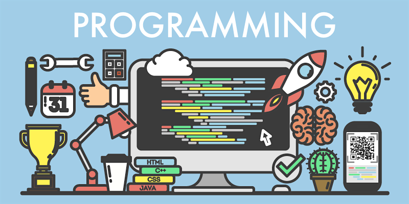

> *"I'm not writing computer program, I'm writing digital poetry."    
> ~Mr Bee*

#### Februari 2020:
* [Selamat Ultah ke-25, Delphi!](ultah-delphi-25.md)

#### March, 2019:
* [10 Tanda Calon Pemrogram Yg Buruk](10-tanda-pemrogram-buruk.md)
* [Memulai Belajar Pemrograman](memulai-belajar-pemrograman.md)

#### February, 2019:
* [Bahasa Pemrograman Untuk Pemula](bahasa-pemrograman-pemula.md)
* [Mengenal Awakutu](mengenal-awakutu.md)

#### July, 2018:
* [Bernostalgia Dengan Kode ANSI](nostalgia-dengan-kode-ansi.md)
* [Free Pascal, SQLdb, dan SQLite](fpc-sqldb-dan-sqlite.md)

#### May, 2018:
* [Free Pascal dan VS Code](fpc-dan-vscode.md)
* [Named Parameter for Pascal](namedparameter.md)
* [Hello World!](hello.md)

---
Also visit my [personal website](https://pak.lebah.web.id), [Tumblr blog](http://paklebah.tumblr.com), [Swift blog](http://medium.com/@pak.lebah) and [GitHub repositories](http://github.com/pakLebah).
