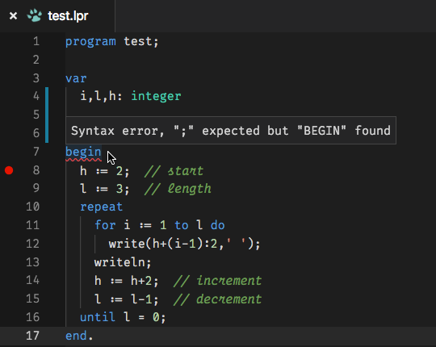
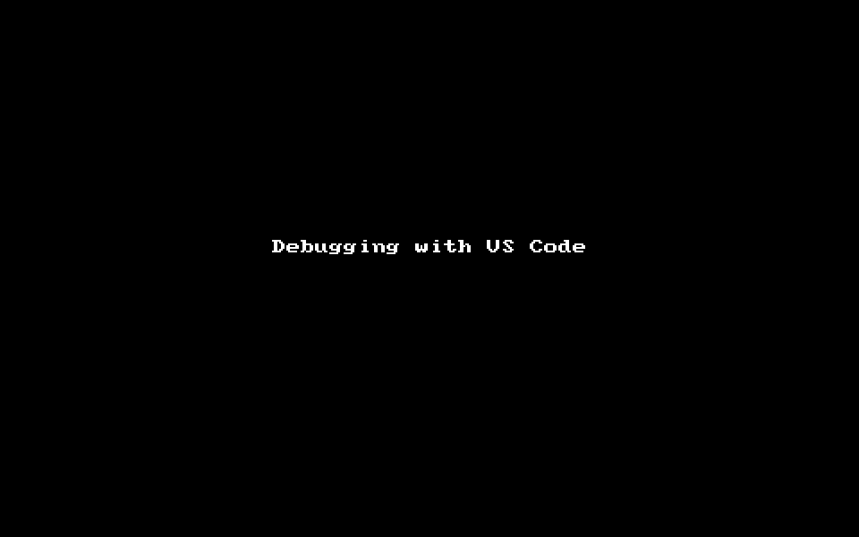

# Mengenal Awakutu

> Seseorang tidak layak disebut pemrogram jika belum menguasai teknik awakutu (*debugging*).    
*~Pak Lebah*

Itu yg saya katakan pada seseorang yg bertanya di grup pemrograman Pascal tentang mengapa program yg dibuatnya tidak bisa bekerja sesuai yg dia harapkan. Padahal pesan kesalahan yg ditampilkan oleh penyunting sudah cukup jelas, tapi dia tidak mampu memahami maksud dari pesan kesalahan tersebut. Dia memang masih belajar pemrograman, tapi ketidak-mampuannya dalam memahami hal-hal yg sederhana dan mendasar seperti itu membuat saya kecewa pada para pembelajar masa kini. Dan pertanyaan seperti itu bukan yg pertama dan saya yakin juga bukan yg terakhir yg akan saya lihat di grup pemrograman (mana pun).

Seperti yg sudah saya jelaskan dalam buku kecil saya tentang [Bekal Belajar Pemrograman][1], pemrogram itu tugasnya adalah berpikir untuk menyelesaikan masalah dengan program komputer. Ada 3 kata kunci di situ, yaitu: *berpikir*, *masalah*, dan *program* (komputer). Pemrogram harus bisa berpikir, tentu berpikir dengan baik sesuai logika yg benar. Dengan kemampuan berpikir, pemrogram harus bisa memahami masalah dengan baik, lalu mencari jalan keluar (solusi) yg terbaik untuk masalah tersebut. Kemudian pemrogram harus bisa menerjemahkan atau mengejawantahkan jalan keluar tersebut menjadi program komputer.

## JENIS KESALAHAN

Maka menjadi seorang pemrogram harus selalu siap menghadapi masalah dan menyelesaikannya. Secara umum, ada 3 jenis kesalahan yg dihadapi pemrogram dalam pembuatan program, yaitu:

### 1. Kesalahan Penulisan

Ini adalah kesalahan yg paling sering terjadi namun paling mudah diatasi. Kesalahan ini terjadi karena pemrogram kurang menguasai cara menyusun program yg benar sesuai bahasa (*syntax error*) atau alat (*build error*) pemrograman yg digunakan. Pemrogram yg kurang menguasai cara menyusun program biasanya karena kurang membaca tata bahasa dan tata kelola alat pemrograman yg digunakan. Setiap pemrogram harus sudah membaca panduan penyusunan program dari bahasa atau alat yg digunakan sebelum menulis sebaris kode program.

Kesalahan ini paling mudah diatasi karena kompilator (*compiler*) akan memberikan pesan kesalahan yg cukup jelas. Misalnya kurang titik koma di baris sekian kolom sekian, atau kelebihan tanda kurung di baris sekian kolom sekian, ada variabel `x` yg tidak dikenali, dan lain-lain, yg biasanya dalam bahasa Inggris. Jika pemrogram tidak mampu memahami pesan kesalahan dan memperbaikinya, baik karena tidak paham penulisan program yg benar atau tidak paham bahasa Inggris, sebaiknya dia kembali ke titik nol lagi yaitu belajar dari awal cara menulis program sesuai bahasa pemrograman yg digunakan. Bila perlu sekalian juga belajar bahasa Inggris.

Penyunting modern telah mampu menunjukkan kesalahan penulisan sebelum kompilator bekerja. Misalnya dengan menandai bagian yg salah dengan garis bawah merah bergerigi, seperti dalam aplikasi Microsoft Word. Penyunting modern juga mampu memberikan saran perbaikan untuk kesalahan penulisan yg umum terjadi. Pengguna tinggal setujui saran yg muncul maka penyunting akan memperbaiki kesalahan secara otomatis (*auto-fix*). Fasilitas demikian biasa disebut dengan *[linter][4]*. Gambar di bawah ini adalah contoh fasilitas *linter* yg disediakan oleh ekstensi [OmniPascal][2] di penyunting [VS Code][3].

### 2. Kesalahan Algoritma

Ini adalah kesalahan akibat ketidak-mampuan pemrogram menerjemahkan solusi menjadi algoritma program yg tepat. Solusi masalah sudah didapat tetapi algoritma program yg disusun tidak sesuai dengan solusi tersebut. Dalam kasus ini, kompilator juga tidak bisa membantu karena bisa jadi penulisan kode programnya sudah benar, algoritmanya saja yg masih salah. Sumber kesalahannya ada di sisi pemrogram maka hanya pemrogram yg bisa memperbaikinya, baik pemrogram aslinya atau pemrogram yg lain.

> **Ingat!** Komputer melakukan apa yg kita perintahkan, bukan melakukan apa yg kita inginkan.

Misalnya, solusinya menyatakan data harus diurutkan dari kecil ke besar, tapi algoritma yg dibuat mengurutkan data dari besar ke kecil. Maka tentu saja hasil kode program tidak sesuai dengan solusi yg diinginkan.

Kesalahan algoritma bisa terjadi secara tidak sengaja atau sengaja. Penyebabnya bisa jadi sepele tapi bisa jadi rumit juga. Kesalahan tidak sengaja misalnya seharusnya ditulis variabel `data1` tapi salah ketik menjadi `data2` atau salah baca menjadi `datal`. Penyebabnya tampak sepele tapi menemukan kesalahan itu dalam kode program belum tentu semudah penyebabnya. Kesalahan yg sengaja misalnya karena belum betul-betul paham solusinya tapi segera dibuat programnya sehingga salah algoritmanya. Kesalahan jenis ini akan lebih sulit lagi memperbaikinya, bahkan kadang kode program harus ditulis ulang dari awal dengan algoritma yg benar.

### 3. Kesalahan Solusi

Ini adalah kesalahan akibat jalan keluar masalah yg diambil kurang tepat untuk menyelesaikan masalah. Tidak ada penyunting atau *linter* atau kompilator yg bisa membantu menyelesaikan kesalahan ini. Kesalahan ini terjadi bahkan sebelum kode program ditulis, maka solusinya adalah kembali lagi ke proses berpikir dan pencarian jalan keluar masalah yg tepat. Jika solusi yg diambil bukan dari pemrogram (misalnya dari atasan pemrogram) maka harus dikembalikan lagi ke yg menentukan solusi tersebut.

## AWAKUTU

Awakutu (*debug*) adalah proses pencarian kesalahan dalam kode program dan memperbaikinya. Biasanya awakutu dilakukan dengan menggunakan alat bantu pemrograman yg disebut dengan *debugger*. Proses pencarian kesalahan disebut *debug* atau *debugging* (awakutu), alat bantunya disebut *debugger*, dan kesalahannya disebut *bug* (kutu). Awakutu berkaitan dengan proses pencarian kesalahan algoritma dalam kode program. Awakutu adalah salah satu kemampuan dasar bagi pemrogram. Jika pemrogram tidak punya kemampuan awakutu maka tidak layak disebut pemrogram.

Namun manfaat awakutu sebenarnya tidak hanya untuk mencari kesalahan algoritma saja. Awakutu juga penting sebagai metode untuk memahami alur jalannya program. *Debugger* memungkinkan pemrogram untuk menjalankan kode program baris-per-baris sehingga pemrogram bisa memahami alur kode program yg dibuatnya. Bagi pemrogram pemula atau yg sedang belajar, manfaat ini bisa jadi lebih penting karena bisa memberikan gambaran langsung bagaimana kode programnya bekerja selangkah demi selangkah.

Ada banyak sekali jenis *debugger*. Ada *debugger* yg bersifat umum untuk berbagai jenis bahasa pemrograman dan kompilator serta sistem operasi, seperti [GNU Debugger][5] dan [LLDB][6]. Ada *debugger* yg bersifat khusus untuk sistem operasi tertentu, seperti [WinDebug][7]. Ada *debugger* yg khusus untuk bahasa pemrograman tertentu, seperti [xdebug][8] untuk bahasa PHP. Ada *debugger* bawaan dari IDE tertentu, seperti [Delphi][9]. Untuk pengguna [Free Pascal][10], hasil kompilasi Free Pascal bisa bekerja dengan *debugger* [gdb][5] atau [lldb][6].

### Fasilitas *Debugger*

Selain bisa menjalankan kode program baris-per-baris, *debugger* juga mempunyai banyak perintah untuk pencarian kutu dan menelusuri jalannya program. Beberapa perintah penting *debugger* antara lain:

- **Titik sorot** (*cursor*) adalah titik (baris) di mana *debugger* sedang berada untuk menerima perintah awakutu selanjutnya. Biasanya diwarnai berbeda di penyunting.
- **Titik henti** (*breakpoint*) adalah titik henti di mana *debugger* akan menghentikan jalannya program setiap kali program mencapai titik (baris) yg ditentukan.
- **Titik henti bersyarat** (*conditional breakpoint*) adalah titik henti yg memiliki syarat di mana *debugger* akan menghentikan jalannya program di titik (baris) tersebut hanya jika syaratnya terpenuhi.
- **Jalankan program** (*run* atau *continue*) adalah perintah bagi *debugger* untuk menjalankan seluruh kode program dari awal atau dari titik sorot hingga mencapai titik henti atau titik henti bersyarat.
- **Jalankan langkah** (*step over*) adalah perintah bagi *debugger* untuk menjalankan hanya satu baris perintah di mana titik sorot sedang berada.
- **Melangkah ke dalam** (*step into*) adalah perintah bagi *debugger* untuk masuk ke kode program yg lebih dalam. Ini hanya berlaku jika baris kode program di titik sorot berupa panggilan subprogram (`procedure` atau `function` dalam Pascal).
- **Melangkah ke luar** (*step out*) adalah perintah bagi *debugger* untuk menjalankan kode program hingga keluar dari lingkupnya ke lingkup yg lebih luar (keluar dari subprogram) atau hingga titik henti berikutnya.
- **Ulangi** (*restart*) adalah perintah bagi *debugger* untuk mengulangi jalannya program dari awal lagi.
- **Hentikan** (*stop*) adalah perintah bagi *debugger* untuk menghentikan jalannya program saat itu juga.

Selain untuk menelusuri jalannya program, biasanya *debugger* juga menyertakan alat bantu lainnya seperti:

- ***Console*** (*debug console*) adalah alat untuk berinteraksi dengan *debugger* yg aktif, misalnya untuk pengaturan atau proses awakutu secara manual.
- **Pantauan** (*watch* atau *watch list*) adalah alat untuk memantau data yg ditampung variabel atau objek dalam kode program, berikut perubahan datanya selama program berjalan.
- **Tumpukan panggilan** (*call stack* atau *stack trace*) adalah alat untuk menelusuri rincian kode perintah di balik kode program yg berjalan. Biasanya berisi perintah yg dibuat kompilator di balik setiap kode program, misalnya pemanggilan perintah sistem seperti Windows API atau perintah mesin virtual.
- **Catatan** (*log* atau *event log*) adalah alat untuk menampilkan berbagai jenis catatan, baik yg dihasilkan oleh program maupun *debugger* sendiri atau program lain yg terkait.
- **Utas** (*thread* atau *thread list*) adalah alat untuk menampilkan utas perintah yg bekerja ketika program sedang berjalan. Ini penting untuk awakutu pada aplikasi multi-utas (*multithread*).
- ***Module*** (subprogram luar) adalah alat untuk menampilkan subprogram luar yg terlibat, seperti berkas *.dll* atau *.so* atau *unit* dalam Pascal, ketika program sedang berjalan.
- ***Disassembler*** adalah alat untuk menampilkan kode mesin (*assembler*) dari kode program aslinya.
- ***CPU*** adalah alat untuk menampilkan yg terjadi di *processor* komputer saat program sedang berjalan.
- ***Memory*** adalah alat untuk menampilkan yg tersimpan di *memory* komputer saat program sedang berjalan.

Bagi pemrogram pemula, yg penting dikuasai lebih dulu adalah perintah penelurusan dan alat bantu pantauan. Dengan memanfaatkan fasilitas tersebut, pemrogram bisa mengikuti alur program baris demi baris serta memantau isi setiap variabel atau obyek yg dibuat selama program sedang berjalan. Pemrogram bisa mengamati secara langsung apa yg sedang terjadi selama programnya bekerja. Dengan demikian, pemrogram bisa betul-betul memahami kode program yg disusunnya.

Dengan penguasaan yg baik pada teknik awakutu, pemrogram bisa menelusuri kode program pada bagian yg diduga sebagai sumber masalah. Pemrogram menelaah bagaimana program bekerja pada bagian tersebut secara langkah demi langkah, sambil melakukan analisa kode dan algoritma. Demikian seterusnya hingga ditemukan sumber masalahnya (*bug*). Setelah itu, langkah selanjutnya bisa jadi adalah perbaikan kode program yg salah (*bug fixing*), perbaikan algoritma menjadi lebih baik, atau bahkan menulis ulang bagian tersebut karena kesalahan algoritma yg fatal.

Berikut adalah contoh bagaimana melakukan awakutu. Contoh dibuat dengan bahasa Pascal menggunakan kompilator Free Pascal, penyunting VS Code dengan ekstensi OmniPascal, dan *debugger* LLDB, di sistem operasi MacOS.

Menarik bukan?

———  
💬 I welcome your comment [here](https://github.com/pakLebah/paklebah.github.io/issues/6).  
Thank you. 😊

---
← [Home](index.md) [Top](#top) ↑

[1]: https://pak.lebah.web.id/ebook/pascal.id_kulgram1.pdf
[2]: https://marketplace.visualstudio.com/items?itemName=Wosi.omnipascal
[3]: https://code.visualstudio.com
[4]: https://en.wikipedia.org/wiki/Lint_programming_tool
[5]: https://www.gnu.org/software/gdb/
[6]: https://lldb.llvm.org
[7]: https://docs.microsoft.com/en-us/windows-hardware/drivers/debugger/
[8]: https://xdebug.org
[9]: https://embarcadero.com/products/delphi
[10]: https://freepascal.org
