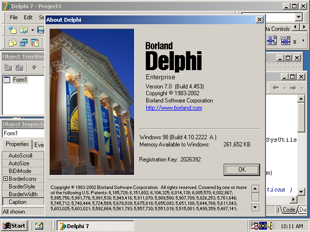

# SELAMAT ULTAH KE-25, DELPHI!

Sejak jadi penggemar Delphi di tahun 1997, tanggal 14 Februari lebih saya ingat sebagai ulang tahun Delphi daripada sebagai Hari Kasih Sayang (*Valentine Day*). Apalagi waktu itu saya masih jomblo, eh salah… *single* maksudnya. *Yes, I’m a programmer, I have no life.* 😊

Delphi yg pertama kali saya gunakan adalah Delphi 3 karena saat ada Windows 3.x saya masih suka berkutat dengan DOS dan Borland Pascal 7. Ketika beralih ke Windows 95, barulah saya mencoba Delphi yg saat itu telah melepas versi 3. Berhubung waktu itu masih mahasiswa kere, saya terpaksa menggunakan bajakan. Maaf ya, mbah Borland.

Namun kali ini saya akan sedikit bercerita tentang kisah Delphi, bukan tentang saya. Saya tidak akan ceritakan seluruh versi Delphi, akan terlalu panjang nanti. Saya ceritakan versi-versi Delphi yg penting saja, versi yg menoreh tinta tebal dalam sejarah perjalanan Delphi selama 25 tahun ini. Yuk, kita mulai… 

## DELPHI 1

Delphi versi 1 dilepas pada tahun 1995 adalah langkah pertama Borland mengenalkan pemrograman RAD (*Rapid Application Development*) dengan metode berbasis aksi (*event-based programming*). Saat itu praktis belum ada saingan yg berarti selain Visual Basic buatan Microsoft yg dilepas pada tahun 1991. Ada juga Java GUI yaitu Swing tapi tidak terlalu banyak digunakan karena kinerjanya yg lambat. 

Secara umum Delphi 1 disambut baik di dunia pemrograman, terutama oleh pemrogram Pascal yg mulai melirik Visual Basic. Kehadiran Delphi 1 seolah menjawab kerinduan pemrogram Pascal pada alat RAD dengan bahasa obyek Pascal. Namun Delphi 1 masih belum mampu mengalahkan dominasi Visual Basic yg hadir lebih dulu.

## DELPHI 5

Delphi terus berkembang hingga Delphi versi 5, yg dilepas pada tahun 1999, mulai melawan dominasi Visual Basic. Dengan slogan *“as easy as VB, as fast as C”* (semudah VB, secepat C) dan *“VB killer”* yg memang sesuai kenyataan karena Delphi adalah alat RAD yg menghasilkan kode *native* untuk Windows 32 bit tanpa perlu *external runtime* seperti Visual Basic. Proses kompilasinya juga lebih cepat dibanding VB dan C/C++.

VCL (*Visual Component Library*) yg jadi tulang punggung Delphi telah matang. Pemrogram Delphi waktu itu membuat ribuan komponen dengan berbagai fungsi yg membuat Delphi semakin disukai pemrogram. Beberapa situs menyediakan layanan lapak komponen Delphi sehingga pemrogram Delphi bisa mencari segala jenis komponen yg mereka butuhkan di satu tempat saja. Salah satu yg terkenal adalah situs [torry.net][1].

Kemudahan membuat program GUI dan kecepatan program hasilnya membuat Delphi mulai dilirik banyak pemrogram, termasuk dari bahasa lain. Banyak pemrogram dari bahasa Java, C/C++, bahkan Visual Basic yg mulai beralih ke Delphi. Borland pun kemudian membuat Borland C++ Builder yg dilepas pada tahun 1997 untuk pemrogram C/C++.

## DELPHI 7

Delphi 7 yg dilepas pada tahun 2002 adalah puncak kejayaan dan pencapaian Delphi (sekaligus Borland). Konon Delphi 7 dianggap sebagai alat pemrograman yg terbaik dan tercepat (di masanya). Banyak aplikasi besar dari berbagai perusahaan besar dunia dibuat dengan Delphi. Salah satu contoh yg paling sering disebut adalah aplikasi Skype, sebelum akhirnya dibeli oleh Microsoft.
Maka tak heran jika Delphi 7 masih cukup banyak digunakan, bahkan hingga hari ini. Walaupun hanya bisa menghasilkan aplikasi untuk platform Windows 32 bit, Delphi 7 masih jadi senjata andalan banyak pemrogram Pascal di berbagai belahan dunia. Ini bukti bahwa Delphi 7 memang alat RAD yg stabil dan matang.

Borland juga mencoba peruntungan dengan membuat *Delphi for Linux* atau disebut Kylix (bersamaan dengan Delphi 6) dan dilanjutkan hingga versi 3 (bersamaan dengan Delphi 7). Sayangnya, Borland setengah hati membuat Kylix sehingga produk yg harusnya bisa jadi terobosan di dunia Linux (tidak alat RAD di Linux waktu itu) malah kurang laku.

## TURBO DELPHI

Delphi 7 adalah titik balik bagi Borland. Apalagi bisa dibilang Delphi 7 sukses menaklukkan VB, sang musuh bebuyutannya. Kesuksesan besar yg dicapai Delphi 7 membuat Borland jadi pongah. Borland merasa dibutuhkan pemrogram sedunia dan mulai jual mahal. Delphi sebagai produk mulai berubah selepas Delphi 7.

Perubahan dimulai dari Delphi 8 yg hanya mendukung *platform* Windows .Net saja. Dukungan pada Windows *native* (juga Linux) sepenuhnya dihilangkan. Terjadi gelombang besar protes pengguna Delphi dari seluruh dunia hingga akhirnya Borland melepas Delphi 9 (Delphi 2005) yg serba tanggung. Delphi 9 jadi gendut dan lambat yg berakibat penjualan Delphi jatuh dan memukul Borland secara finansial.

Untuk tetap mempertahankan Delphi, Borland melepas tim Delphi sebagai anak perusahaan bernama CodeGear (agar kelak bisa dijual terpisah). Nama Delphi mendapat embel-embel “studio” lalu dijual dengan harga yg sangat mahal. Jika Delphi 7 dan sebelumnya dijual dalam rentang ratusan dolar Amerika, Delphi Studio naik menjadi ribuan dolar Amerika.

Pada tahun 2006, CodeGear bereksperimen dengan melepas versi Delphi gratis dengan nama Turbo Delphi. Turbo Delphi sempat menarik perhatian besar dari pemrogram Pascal sedunia. Blog lama saya yg sepi, mendadak ramai dikunjungi banyak orang setelah saya menulis artikel [cara pemasangan komponen sendiri di Turbo Delphi][2]. Ya, Turbo Delphi gratis mempunyai batasan tidak bisa memasang komponen selain yg telah disertakan.

Keberhasilan Turbo Delphi menarik perhatian pemrogram Pascal membuat CodeGear makin percaya diri bahwa Delphi masih punya banyak penggemar. CodeGear melanjutkan strategi bisnis “studio” dengan harga jual yg mahal. Turbo Delphi tampaknya hanya jadi *portfolio* saja bagi CodeGear. Namun alih-alih Delphi makin laris, CodeGear justru makin terpuruk. Hingga akhirnya CodeGear dibeli oleh Embarcadero pada tahun 2008, yg konon kabarnya dengan harga yg murah.

## RAD STUDIO: DELPHI CE

Embarcadero, pemilik Delphi yg baru, sedikit mengubah strategi penjualan Delphi. Oh, tidak… tidak dengan membuatnya murah lagi, tapi dengan mengubah target pasar ke pangsa bisnis (*enterprise*) sehingga harga mahal masih bisa diterima. Pangsa pengguna pribadi hampir sepenuhnya diabaikan. Kemampuan Delphi juga makin ditingkatkan dengan dukungan ke *platform* web, *mobile*, Linux dan Mac. Tampaknya strategi ini cukup berhasil karena Delphi masih terus dikembangkan hingga detik ini di Embarcadero.

Di sisi lain, penggemar individu mulai beralih ke alat atau bahasa lainnya. Apalagi era 2010-an adalah masa ramai munculnya alat-alat dan bahasa pemrograman baru yg tersedia gratis dan kode terbuka. Di pangsa individu, Delphi (sebagai produk) semakin dilupakan. Alternatif yg paling dekat bagi mantan pengguna Delphi adalah [Free Pascal][3] (*compiler*) dan [Lazarus IDE][4], keduanya gratis dan kode terbuka, yg 99% selaras (*compatible*) dengan Delphi dan VCL-nya. Saya beralih sejak Delphi 9.

Namun tiba-tiba ada kejutan dari Embarcadero, yaitu dilepasnya *"RAD Studio: Community Edition”* di akhir 2018 yg lalu. *Community Edition* adalah versi gratis dari RAD Studio, tentu termasuk *[Delphi Community Edition][5]* (Delphi CE). Gebrakan ini cukup menghebohkan jagad Pascal dunia. Pemrogram Pascal sedunia ramai-ramai mengunduh dan mencoba Delphi CE. Ulasan secara umum mengatakan Delphi CE sangat bagus dan cukup memenuhi kebutuhan pemrogram Pascal masa kini. Satu-satunya batasan Delphi CE adalah tidak mendukung *platform* Linux (hanya tersedia di versi berbayar).

Tampaknya Embarcadero mulai memberi perhatian pada pangsa pasar individu. Bahasa Pascal atau Delphi mulai kembali diperbincangkan di dunia pemrograman daring. Walaupun boleh dibilang cukup terlambat tapi kita harus tetap apresiasi Embarcadero atas Delphi CE. Diharapkan Delphi CE bisa kembali mengangkat nama besar bahasa Pascal seperti di masa jaya Turbo Pascal 7 dan Delphi 7 dulu. Semoga.

Selamat ulang tahun, Delphi! 🎂🥳

> **Catatan:** Saya menulis ini hanya berbekal ingatan saja. Jika ada salah atau kurang, mohon koreksinya di kolom komentar. Terima kasih.

———  
💬 I welcome your comment [here](https://github.com/pakLebah/paklebah.github.io/issues/10).  
Thank you. 😊

---
↠[Home](index.md) [Top](#top) ↑  

[1]: torry.net
[2]: https://beeography.wordpress.com/2006/09/12/just-wanna-let-you-know/
[3]: https://freepascal.org/
[4]: https://lazarus-ide.org/
[5]: https://www.embarcadero.com/products/delphi/starter/
